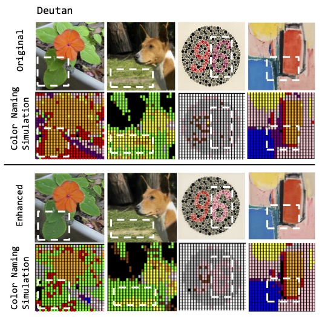
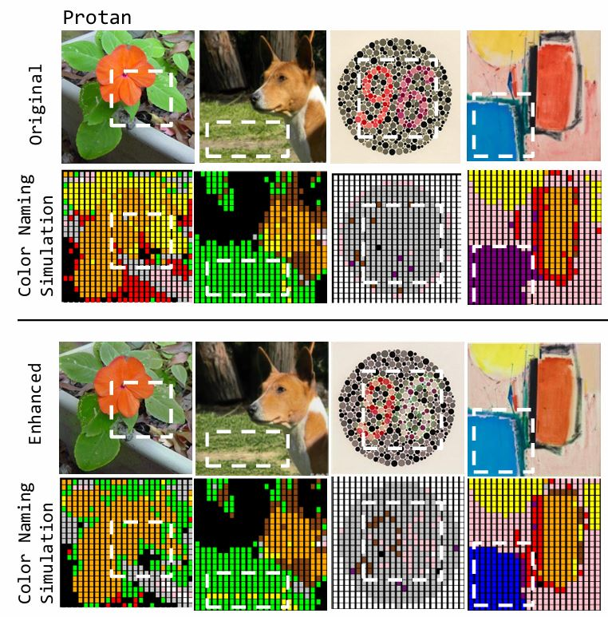
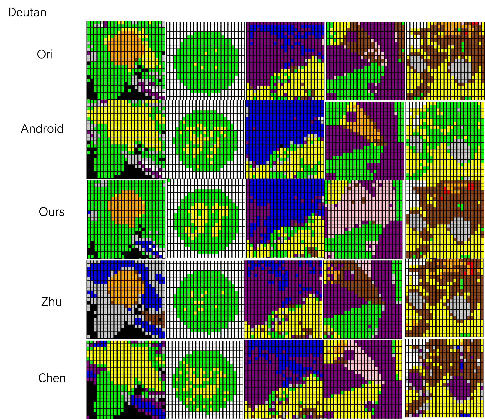
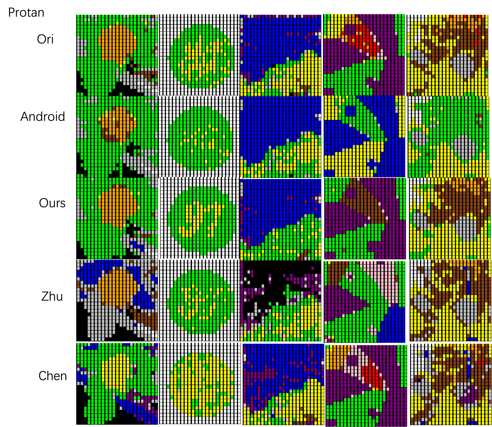

# Code for Image Enhancement for Color Vision Deficiency based on Empirical Color Naming Simulation

## Background  
CVD (Color Vision Deficiency) can cause significant challenges in visual communication and interaction, as it can make it difficult for individuals with CVD to distinguish between colors and follow color instructions. While existing CVD color filter algorithms address the seperation of color components for CVD (e.g. color filter in iOS and Android for accessibility), our color filter also make the color namable for CVD. In this case, CVD can distinguish and identify the color correctly. 

## Visualization

Visualization of our color naming simulation model and color filter model for deutan type CVD. The top two rows are original images while the bottom two rows are images after enhancement by our color filter. On each side, the first row shows the sRGB images in normal view, the second row plots color naming results with representative colors for our deutan color naming simulation model.

Visualization of our color naming simulation model and color filter model for protan type CVD.

Images before enhancement and after enhancement using Android, Zhu, Chen and ours methods (Deutan)

Perceived color names for Deutan

Images before enhancement and after enhancement using Android, Zhu, Chen and ours methods (Protan)

Perceived color names for Protan

